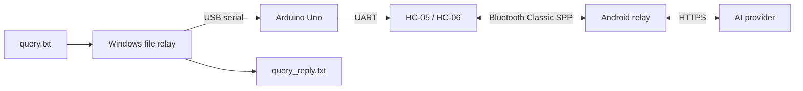

# TI-84 Relay

[](https://github.com/giu176/TI-84-relay/actions/workflows/ci.yml)
[](LICENSE)
[](android/README.md)

TI-84 Relay turns a classic monochrome TI-84 Plus into a compact AI chat terminal. An Arduino bridge moves framed messages between the calculator link port and a Bluetooth Classic module; an Android app maintains the radio connection and relays requests to an AI provider.

> [!IMPORTANT]
> The PC → Arduino → Bluetooth → Android → AI round trip is working. The protected TI-84 link-port hardware and calculator client are the next milestone.

## Working prototype



Validated hardware/software:

- Arduino Uno and ZS-040-compatible HC-06 at 9600 baud;
- Pixel 10 running GrapheneOS/Android 16;
- OpenAI Responses API end-to-end;
- Anthropic Messages, Gemini `generateContent`, and generic OpenAI-compatible adapters with mocked parser tests;
- COBS framing, CRC-16, ACK/retry, chunking, transaction deduplication, and response recovery.

## Repository layout

| Path | Purpose |
|---|---|
| [`android/`](android/) | Kotlin/Compose Android relay application |
| [`arduino/`](arduino/) | Uno bridge and HC-05/HC-06 configuration consoles |
| [`tools/file_relay/`](tools/file_relay/) | Python `query.txt` serial client |
| [`protocol/spec.md`](protocol/spec.md) | Normative wire protocol |
| [`documents/blueprints.md`](documents/blueprints.md) | Full project architecture and future milestones |

## Hardware

### Arduino ↔ Bluetooth module

| HC-05/HC-06 pin | Arduino Uno | Notes |
|---|---|---|
| `VCC` | `5V` | Only for a carrier board with an onboard regulator |
| `GND` | `GND` | Common ground |
| `TXD` | `D10` | Module output to Uno `SoftwareSerial` RX |
| `RXD` | `D11` through 1 kΩ | Add 2 kΩ from module RXD to GND |
| `STATE` | `D7` through 1 kΩ | Optional |

The 1 kΩ/2 kΩ divider protects the module's approximately 3.3 V RX input from the Uno's 5 V TX output. External capacitors are optional for the breadboard prototype; keep wires short and add local decoupling only if the module resets or corrupts traffic.

See [arduino/README.md](arduino/README.md) before wiring or changing AT settings.

## Quick start

### 1. Upload the bridge

Open [`arduino/pc_bt_bridge/pc_bt_bridge.ino`](arduino/pc_bt_bridge/pc_bt_bridge.ino) in Arduino IDE and upload it to an Uno. Do not leave Serial Monitor open while using the file relay.

### 2. Build and install Android

Open `android/` in Android Studio with JDK 17 and Android SDK 35, or run:

```powershell
cd android
.\gradlew.bat testDebugUnitTest lintDebug assembleDebug
```

Install `android/app/build/outputs/apk/debug/app-debug.apk`. In the app:

1. Pair `TI84-RELAY`, `HC-05`, or `HC-06` using Android's system dialog.
2. Select the bonded module and connect.
3. Configure a provider and run its self-test.

API keys are encrypted with Android Keystore and are never stored in this repository.

### 3. Set up the Windows relay

From PowerShell in the repository root:

```powershell
py -3 -m venv .venv
.\.venv\Scripts\python.exe -m pip install -r .\tools\file_relay\requirements.txt
```

Put a UTF-8 prompt in `query.txt`, then run:

```powershell
.\send-query.cmd COM3
```

The port defaults to `COM3`; pass another port when needed. List ports with:

```powershell
.\.venv\Scripts\python.exe -m serial.tools.list_ports
```

The response is printed and atomically written to the ignored `query_reply.txt` file.

## AI providers

The Android app directly supports:

- OpenAI Responses API;
- Anthropic Messages API;
- Google Gemini `generateContent`;
- configurable OpenAI-compatible Chat Completions endpoints.

Model defaults are editable because provider availability changes. Provider API access and billing are separate from consumer subscriptions such as ChatGPT.

## Safety and privacy

- Never commit provider keys, authorization headers, transcripts, or Android `local.properties`.
- The current Bluetooth modules use legacy PIN-based Bluetooth Classic pairing; do not treat the radio link as appropriate for sensitive data.
- The future TI-84 interface requires a protected open-collector circuit. Never connect Uno GPIO directly to the calculator link port.
- This project is not intended for exams or other environments where wireless devices or AI assistance are prohibited.

## Development

Run local checks:

```powershell
# Python
py -3 -m unittest discover -s tools/file_relay -p "test_*.py"

# Arduino
arduino-cli compile --fqbn arduino:avr:uno arduino/pc_bt_bridge

# Android
cd android
.\gradlew.bat testDebugUnitTest lintDebug assembleDebug
```

See [CONTRIBUTING.md](CONTRIBUTING.md) for contribution expectations and [SECURITY.md](SECURITY.md) for private vulnerability reporting guidance.

## License

Released under the [MIT License](LICENSE).

