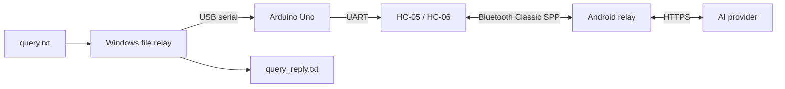

# TI-84 Relay — Project Blueprint

Status: working end-to-end prototype; Android chat is the next implementation milestone

Target calculator: classic monochrome TI-84 Plus (Z80, 96×64 display)

Phone target: Android 12+

Last updated: 2026-06-21

## 1. Project goal

TI-84 Relay turns a classic TI-84 Plus into a compact AI chat terminal. The final data path is:


The calculator will own compact text entry, response display, scrolling, and link status. The Android app will own the full conversation history, image input, Bluetooth connection, authentication, AI requests, persistence, and conversion of rich responses into a calculator-friendly format.

The current prototype replaces the calculator with a Windows `query.txt` client. This lets the transport and AI relay be proven before connecting untested hardware to the TI-84 link port.

## 2. Current working prototype

The following round trip is working:



This matches the working prototype documented in the root `README.md`.

### Completed

- Windows file relay reads a UTF-8 prompt from `query.txt`, sends it over USB serial, prints the response, and atomically writes `query_reply.txt`.
- Arduino Uno bridge forwards framed traffic between USB serial and an HC-05/HC-06-compatible Bluetooth module.
- HC-05/HC-06 configuration sketches and wiring instructions are present.
- Android 12+ Kotlin/Compose application pairs with or selects a bonded Bluetooth Classic device, connects over SPP, and maintains the relay connection in a foreground service.
- The Android relay has bounded reconnect behavior and a Room transaction journal for recovery and deduplication.
- Provider credentials are stored with Android Keystore-backed encryption and are not stored in the repository.
- OpenAI Responses API works end to end.
- Anthropic Messages, Gemini `generateContent`, and generic OpenAI-compatible Chat Completions adapters are implemented, with mocked parser tests.
- Provider selection, editable endpoint/model configuration, and provider self-tests are implemented.
- Protocol v1 includes COBS framing, CRC-16 validation, sequence numbers, ACK/retry, chunking, transaction deduplication, and response recovery.
- Python protocol tests, Android protocol tests, provider tests, Android lint/build tasks, and Arduino compilation commands are documented.

### Validated prototype setup

- Arduino Uno;
- ZS-040-compatible HC-06 at 9600 baud (the code also accommodates HC-05 naming/configuration);
- Pixel 10 running GrapheneOS/Android 16;
- Android minimum target of Android 12;
- OpenAI Responses API for the real end-to-end test.

### Not implemented yet

- a user-facing conversation screen and persistent chat-log browser in the Android app;
- sending text and pictures directly from the Android chat UI;
- supported OpenAI browser/device authorization tied to a user's ChatGPT account;
- the protected TI-84 two-wire electrical interface;
- calculator-side link driver, editor, transcript UI, and AI chat client;
- calculator-backed mathematical tools for agentic AI use.

## 3. Repository map

| Path | Current purpose |
|---|---|
| `android/` | Kotlin/Compose Bluetooth relay, provider adapters, secure settings, and transaction persistence |
| `arduino/pc_bt_bridge/` | Working Uno USB-serial ↔ Bluetooth bridge |
| `arduino/hc05_config/` | HC-05 configuration console |
| `arduino/hc06_config/` | HC-06 configuration console |
| `tools/file_relay/` | Working Python `query.txt` serial client and protocol tests |
| `protocol/spec.md` | Normative wire protocol |
| `documents/blueprints.md` | Project status, architecture, and roadmap |

Future calculator and hardware directories should be added only when implementation begins, so the documented repository layout continues to describe the repository that actually exists.

## 4. Design boundaries

### Calculator model

The primary target is the original monochrome TI-84 Plus or Silver Edition. The TI-84 Plus C Silver Edition and TI-84 Plus CE use different displays and toolchain families and require separate ports.

### Calculator connection

The first calculator implementation will use the 2.5 mm I/O link port, not USB. The link port is a two-wire, open-drain-style handshake bus; it is not UART.

Never connect Uno GPIO pins or an HC-05/HC-06 UART directly to the calculator link lines. The interface must allow each line to be sensed at high impedance or pulled low while never actively driving it high. The exact circuit and component values must be checked against measurements from the specific calculator revision.

### Responsibility split

The Android app is the authoritative owner of full conversations and rich content. The calculator receives a bounded, plain-text/math-friendly projection of the conversation. Provider JSON, credentials, browser tokens, and image bytes must never be sent to the calculator.

### Provider access

User-supplied API keys are the working authentication method today. API access and consumer subscriptions such as ChatGPT Plus/Pro are separate products unless OpenAI explicitly provides a supported authorization path for the client being built.

## 5. Next implementation roadmap

The next work deliberately improves the phone experience before replacing the proven PC test source. This keeps the working transport intact while each new layer is tested independently.

### Phase 1 — Android chat logs and multimodal composer

Build a user-friendly Android conversation experience comparable in interaction quality to a modern chat app.

#### Scope

- Add a conversation list with titles, timestamps, last-message previews, create, rename, and delete actions.
- Add a chat screen with clearly differentiated user and assistant messages.
- Persist conversations and messages locally in Room, including delivery/generation status and provider metadata.
- Add a composer that sends normal text messages directly from the phone without requiring `query.txt`.
- Support attaching pictures from the Android photo picker and, if useful, the camera.
- Show attachment previews and allow removal before sending.
- Send images only when the selected provider/model advertises image-input capability; otherwise show an actionable explanation.
- Store durable Android content references or app-owned copies according to an explicit retention policy.
- Show generating, retry, cancel, failure, and resend states without creating duplicate provider calls.
- Render common response content cleanly, including Markdown, code blocks, lists, and mathematical text.
- Keep calculator-originated and phone-originated messages in the same conversation model so the TI-84 can later join an existing chat.

#### Architectural changes

Use one provider-neutral message model for text and image parts. The provider adapters translate this model into each provider's supported request format. Conversation persistence must be separate from the existing transport transaction journal: a chat message is a user-visible domain object, while a relay transaction tracks reliable delivery.

The initial image implementation should send selected images to the configured provider and display them on the phone. The calculator will receive only text descriptions or the resulting assistant response because its protocol and display are not suitable for image transfer.

#### Acceptance criteria

- A user can create a conversation, send multiple text messages, leave the screen, restart the app, and reopen the complete log.
- A user can attach a picture, preview it, send it to a capable model, and receive a response in the same conversation.
- Unsupported provider/model combinations are rejected before network submission.
- Cancelling, reconnecting, rotating the device, or recreating the process does not duplicate messages.
- Secrets and private image contents are absent from normal logs and exported diagnostics.

### Phase 2 — OpenAI browser/device login feasibility and implementation

Investigate and, only if supported for this application, implement OpenAI account authorization using a short device code such as `XXXX-XXXXX` and browser login on the phone. The user has seen a similar experience in Odysseus; that implementation can be studied for terminology and user flow, but its private or unofficial endpoints must not be copied blindly.

The likely standards terminology is **OAuth 2.0 Device Authorization Grant** (often called *device-code login* or *device login*). The desired experience is:

1. The app requests a short-lived device/user code from an authorized OpenAI endpoint.
2. The app opens the verification page in the phone's browser or a secure browser tab.
3. The user signs in to their OpenAI/ChatGPT account and approves access.
4. The app polls at the required interval until authorization succeeds or expires.
5. Tokens are stored with Android Keystore protection, refreshed safely, and revocable through a sign-out action.

#### Required feasibility gate

Before implementation, confirm from current official OpenAI documentation and terms that:

- a public device authorization flow exists for this kind of third-party Android client;
- the issued credentials may access the required model endpoints;
- ChatGPT subscription entitlements can legally and technically fund those requests;
- app registration, client identification, scopes, token refresh, and revocation are documented.

If those conditions are not met, retain user-supplied API keys or introduce a supported server-side authorization/token broker. Do not scrape ChatGPT, automate browser cookies, extract tokens from another app, impersonate an official client, or imply that a ChatGPT subscription automatically includes API usage.

#### Acceptance criteria

- The user can clearly choose between API-key access and any supported account-login method.
- Login, expiry, cancellation, refresh, sign-out, and revoked-access paths are tested.
- Tokens never appear in logs, Room plaintext, backups, diagnostics, or repository files.
- The UI accurately explains which plan or billing source is being used.

### Phase 3 — Replace `query.txt` with the real TI-84 Plus

After the Android chat and authentication layers are stable, replace the Windows test sender with the actual calculator while retaining the proven Android, Bluetooth, and provider pipeline.

#### Hardware work

- Identify and record the exact TI-84 Plus revision.
- Design and review a protected two-channel open-collector/open-drain interface.
- Verify tip, ring, sleeve, idle voltage, asserted voltage, rise time, and current limits with measurement equipment.
- Confirm that the Uno can only release or pull down each calculator link line.
- Keep the existing protected Uno-to-HC-05/HC-06 UART connection.

#### Calculator software

- Implement timeout-safe, bidirectional TI link-port byte primitives.
- Validate every byte value in both directions and recover cleanly after unplugging.
- Add protocol framing, CRC, ACK/NACK, retry, chunking, session handshake, and bounded buffers compatible with `protocol/spec.md`.
- Build a compact calculator chat UI with text entry, send/cancel, scrolling transcript, connection state, and visible errors.
- Transliterate unsupported Unicode and convert rich AI output into a deterministic calculator-friendly math/text subset on Android.
- Keep only bounded recent history on the calculator; Android remains the authoritative transcript.

#### Staged validation

1. Transfer fixed patterns and all byte values between Uno and calculator.
2. Display `HELLO FROM ARDUINO` reliably on the calculator.
3. Send calculator-entered text to the Uno without Bluetooth.
4. Carry the same packets through HC-05/HC-06 and Android.
5. Send a calculator question to the configured AI provider and deliver the answer back.
6. Pass corruption, duplicate, reconnect, radio-power-cycle, and long-message tests.

#### Acceptance criteria

- The calculator completes a multi-message AI conversation without the PC relay.
- The UI remains responsive during receive, retry, and reconnection.
- No malformed or oversized frame causes a crash, stuck link line, or buffer overrun.
- Reconnection never submits a user message to the AI provider twice.
- The protected electrical interface is documented with a schematic, measurements, and bill of materials.

### Phase 4 — Agentic calculator mathematics

After chat integration, add narrowly scoped agentic features that let the AI ask the calculator to perform advanced calculus and other mathematical calculations, then incorporate verified results into its answer.

This must use structured tool calls rather than free-form commands. A request should identify an allowed operation and typed arguments; the calculator returns a typed result or bounded error. Candidate tools include numerical evaluation, equation solving, derivatives, integrals, matrices, statistics, graph sampling, and access to selected calculator variables.

Start with a small read-only tool set. Require confirmation before modifying variables, programs, graph settings, or persistent calculator state. Enforce operation allowlists, argument/size limits, timeouts, cancellation, and clear provenance so the chat shows whether a result came from the AI model, Android code, or the physical calculator.

The calculator is a useful computational tool, not an unquestioned oracle: domain errors, approximation limits, numeric precision, and unsupported symbolic operations must be returned explicitly.

## 6. Protocol and persistence principles

- Treat USB serial, UART, and RFCOMM as byte streams that may split or combine frames.
- Keep the provider-neutral protocol independent of OpenAI, Anthropic, Gemini, or any particular model.
- Bound every length before allocation or storage.
- Persist an idempotency key before making an AI request.
- Persist a completed response before attempting Bluetooth delivery.
- Resume response delivery from acknowledged chunks without calling the provider again.
- Keep content frames structurally separate from control frames; provider output is untrusted data.
- Version protocol and database records and test migrations before release.

## 7. Security, privacy, and operational rules

- Make it explicit when calculator or phone content is sent to an AI provider.
- Provide conversation deletion and define image/transcript retention behavior.
- Protect credentials and account tokens with Android Keystore-backed storage.
- Never commit API keys, tokens, authorization headers, transcripts, or private images.
- The legacy PIN-based Bluetooth Classic link is not appropriate for highly sensitive data.
- Do not connect 5 V push-pull GPIO directly to the calculator link port.
- Do not market or use the project for exams or environments where wireless devices or AI assistance are prohibited.
- Do not use undocumented authentication endpoints in a distributed build without an explicit legal and security review.

## 8. Verification commands

Run the checks documented in the root README:

```powershell
# Python
py -3 -m unittest discover -s tools/file_relay -p "test_*.py"

# Arduino
arduino-cli compile --fqbn arduino:avr:uno arduino/pc_bt_bridge

# Android
cd android
.\gradlew.bat testDebugUnitTest lintDebug assembleDebug
```

Hardware acceptance tests must be performed separately on the exact Uno, Bluetooth module, Android phone, and TI-84 Plus revision used by the project.

## 9. Definition of the next useful releases

### Android chat release

The phone can create and reopen conversations, send text and pictures, display polished responses, and recover safely from process or network interruptions.

### Account-login release

If officially supported, the phone can authorize through a short device code and browser flow, clearly reporting the entitlement and billing source. Otherwise the app clearly retains supported API-key authentication.

### Calculator release

The TI-84 Plus replaces `query.txt`, sends a typed question through the Uno and Bluetooth bridge, displays the AI response, and recovers from one radio power cycle without duplicating the question.

### Agentic mathematics release

The AI can invoke a small, auditable set of calculator operations through structured requests and incorporate the calculator's typed results into the conversation.

## 10. Immediate backlog

- [x] Prove PC → Uno → Bluetooth → Android → AI round trip.
- [x] Implement protocol framing, CRC, ACK/retry, chunking, deduplication, and response recovery.
- [x] Implement encrypted provider settings, self-tests, and multiple provider adapters.
- [ ] Add Android conversation and message persistence for user-visible chat logs.
- [ ] Build the Android chat list, conversation screen, and text composer.
- [ ] Add Android photo selection, preview, multimodal provider mapping, and retention controls.
- [ ] Research official OpenAI device authorization and ChatGPT subscription entitlement support.
- [ ] Implement supported browser/device login or document why API-key access remains required.
- [ ] Design and validate the protected TI-84 link-port interface.
- [ ] Implement and test the calculator link driver.
- [ ] Build the calculator chat client and replace the Windows file relay.
- [ ] Specify the calculator math-tool protocol and implement the first safe agentic operations.
