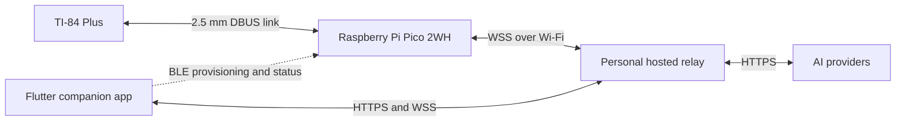
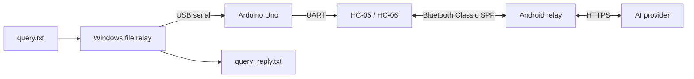

# TI-84 Companion — Project Blueprint

Status: architecture selected; Pico 2WH compatibility and repository migration are the next milestones

Primary calculator: plain monochrome TI-84 Plus (Z80, 96×64 display)

Primary bridge: Raspberry Pi Pico 2WH (RP2350 with pre-soldered headers)

Companion targets: Android and iOS through one Flutter application

Last updated: 2026-06-21

## 1. Product vision

TI-84 Companion turns a classic TI-84 Plus into a connected AI terminal while preserving a full, modern chat experience on the user's phone.

The calculator provides compact text and math entry, a pinned-conversation browser, recent text history, paging, connection status, and visible errors. The companion app provides complete rich chat history, images, Markdown and formula rendering, provider and device settings, and synchronization. The relay allows the calculator to continue text-only conversations when the phone is absent.

The initial deployment is personal and self-hosted. Public accounts, billing, quotas, and multi-tenant administration are explicitly deferred.

## 2. Decisions already made

- The Raspberry Pi Pico 2WH is the primary and only initially supported bridge board.
- The plain monochrome TI-84 Plus is the first calculator target. Silver Edition, C Silver Edition, CE, and other models require separate validation.
- The calculator uses its 2.5 mm link port, not USB.
- Normal calculator traffic uses WSS over Wi-Fi. BLE is used only for provisioning, credential rotation, status, diagnostics, and reset.
- A personal hosted relay performs AI-provider calls; provider implementations are not duplicated in Pico firmware.
- The Flutter app is authoritative for complete rich conversations and local image files.
- The relay keeps bounded text copies of up to eight phone-pinned conversations plus unacknowledged calculator events.
- Images are handled only by the companion app and relay. Image bytes are never sent to the Pico or calculator.
- The working Arduino prototype is preserved as a possible future hardware variant, not discarded or silently rewritten.

## 3. Proven starting points

### GPTi84-Plus upstream

The new product will fork `xandwr/GPTi84-Plus`, which provides the starting implementation for:

- open-drain-style DBUS signalling by switching GP6 and GP7 between input/pull-up and output-low;
- bit, byte, packet, checksum, and TI variable-transfer layers;
- timeout-safe calculator-to-Pico and Pico-to-calculator transfers;
- the Z80 `CHAT` sender and TI-BASIC `DECK` pager;
- TI token decoding for text and mathematical expressions;
- calculator-safe string encoding and fixed-grid pagination;
- Wi-Fi, TCP/WSS, TLS, reconnect, and bridge supervision;
- host-side framing, tokenizer, transfer, and deployment tests.

Upstream was tested on the original Pico W and a plain TI-84 Plus. It has not established Pico 2WH/RP2350 compatibility. The Pico currently connects to an external relay; it does not directly call OpenAI, Anthropic, Gemini, or other AI APIs.

### Existing Arduino prototype

This repository has already validated:

Completed prototype capabilities include COBS framing, CRC validation, ACK/retry, chunking, transaction deduplication, response recovery, Android Keystore-backed settings, a Room transaction journal, and adapters for OpenAI, Anthropic, Gemini, and OpenAI-compatible APIs.

This prototype remains valuable reference material for reliability, provider behavior, tests, and a future Arduino edition. It is not the target architecture for TI-84 Companion.

## 4. Pico 2WH compatibility gate

No product feature work begins until the upstream calculator bridge works reliably on the actual Pico 2WH.

The `WH` suffix means the wireless Pico 2 board has pre-soldered headers. It does not change GPIO numbering or firmware behavior. The board uses RP2350, so it must receive a Pico 2 W-compatible MicroPython UF2; an original Pico W/RP2040 UF2 must never be installed.

### Stage A — Runtime validation

1. Install a current Pico 2 W-compatible MicroPython build.
2. Verify `machine.Pin`, input pull-ups, output-low operation, and monotonic timing functions.
3. Verify filesystem persistence and recovery after reset and abrupt power loss.
4. Verify Wi-Fi association, DHCP, DNS, NTP, TCP sockets, TLS certificate validation, and WSS.
5. Verify BLE scanning, connection, secure provisioning primitives, and reconnect behavior.
6. Run the upstream host-only test suite and repair RP2350-specific incompatibilities without changing protocol behavior.

### Stage B — Electrical validation

1. Identify and record the exact TI-84 Plus hardware revision.
2. Measure tip, ring, and sleeve; idle and asserted voltages; rise time; and current on the actual calculator.
3. Verify that GP6 and GP7 only release a line or pull it low and never actively drive it high.
4. Connect TIP to GP6, RING to GP7, and sleeve to ground only after measurements confirm the upstream direct-wiring method is safe for the exact calculator and Pico 2WH.
5. Stop and design a two-channel open-drain protection stage if measured levels exceed RP2350 GPIO limits or behavior differs from the tested upstream arrangement.

### Stage C — Link and network parity

1. Receive fixed patterns and every byte value from the calculator.
2. Send fixed patterns and every byte value to the calculator.
3. Validate checksums, timeouts, unplug recovery, stuck-line recovery, and repeated power cycles.
4. Transfer TI strings, real variables, programs, and bounded payloads in both directions.
5. Reproduce the upstream echo relay.
6. Reproduce the upstream TLS/WSS LLM relay loop.
7. Tag the passing revision as the first Pico 2WH compatibility baseline.

## 5. Target repository structure

The primary repository will be a real GitHub fork of `xandwr/GPTi84-Plus`.

| Path | Purpose |
|---|---|
| `src/` | Pico 2WH firmware, retaining the recognizable upstream layout |
| `programs/` | Z80 and TI-BASIC calculator programs |
| `tools/` | Upstream development, tokenization, deployment, and diagnostic tools |
| `tests/` | Upstream-compatible firmware and protocol tests |
| `backend/` | FastAPI relay, provider adapters, persistence, WSS, and tests |
| `apps/companion/` | New Flutter Android/iOS companion app |
| `legacy/arduino-relay/` | Complete current Arduino/Android/Python prototype with its history |
| `docs/architecture.md` | Detailed interfaces, protocols, storage, and security design |
| `NOTICE` | Upstream attribution and retained copyright notices |

Git practices:

- configure the fork as `origin` and `xandwr/GPTi84-Plus` as `upstream`;
- retain upstream directories and history so useful changes can still be merged;
- import the current `giu176/TI-84-relay` repository with `git subtree` without squashing;
- keep the original Arduino repository intact;
- tag the untouched GPTi84 fork, the imported Arduino prototype, and the Pico 2WH parity baseline;
- protect `main` and require relevant automated tests before merging;
- contribute generic DBUS or RP2350 fixes upstream when practical.

## 6. Responsibility and data ownership

### Calculator

- Collect text and optional math input.
- Browse up to eight pinned conversations using 16-character titles.
- Open a pinned conversation and page through bounded recent text context.
- Continue the selected conversation without the phone.
- Display projected assistant replies in at most eight 16×7-character pages.
- Show connection, generation, synchronization, timeout, and provider errors.

### Pico 2WH

- Translate TI DBUS and variable transfers into versioned relay messages.
- Maintain Wi-Fi and authenticated WSS connectivity.
- Deduplicate and acknowledge messages across reconnects.
- Perform BLE provisioning and expose bounded operational status.
- Store only the minimum device, Wi-Fi, relay, and recovery configuration.
- Never store provider API keys or image data.

### Hosted relay

- Authenticate the companion administrator and individual Pico devices separately.
- Store provider configurations and API keys encrypted with a deployment master key.
- Call OpenAI Responses, Anthropic Messages, Gemini `generateContent`, configurable OpenAI-compatible endpoints, and Ollama.
- Maintain provider-neutral conversation requests and idempotency records.
- Store bounded text context for the eight pinned calculator conversations.
- Queue calculator messages until acknowledged by the phone.
- Convert rich assistant output into deterministic TI-safe text pages.
- Process phone-uploaded images transiently and delete temporary image data after completion.

### Flutter companion app

- Own the complete local conversation and message database.
- Store rich Markdown, formulas, provider metadata, delivery state, and app-private image files.
- Configure and test providers through the relay.
- Provision the Pico over BLE with Wi-Fi, relay endpoint, and device credentials.
- Create, rename, delete, search, pin, unpin, and reorder conversations.
- Send normal phone messages and image-assisted messages.
- Synchronize calculator-originated messages without duplication.
- Push selected conversations and their bounded text projections to the calculator service.

## 7. Conversation and synchronization model

The phone remains authoritative for full rich history. The relay is authoritative only for delivery state, provider calls, device-visible projections, and pending calculator synchronization.

- At most eight conversations can be pinned for calculator access.
- Pin order determines the calculator's numeric menu order.
- A pinned title is deterministically transliterated and truncated to 16 TI-safe characters.
- Pinned relay context is text-only, bounded, and sufficient for provider continuity without the phone.
- Calculator messages receive stable unique IDs before provider submission.
- The relay persists the idempotency record before calling a provider.
- Replayed or duplicated messages return the stored result instead of making a second provider call.
- Calculator-originated messages remain queued until the phone acknowledges importing them.
- Unpinning removes the relay's calculator-visible copy after pending synchronization completes.
- The phone may retain the original rich conversation indefinitely according to user-controlled local retention.

Images can originate only from the companion app. The relay may send the resulting assistant text projection to a pinned calculator conversation, but the original image and rich response remain phone-only.

## 8. Relay interfaces

The personal release uses FastAPI and SQLite. TLS is mandatory outside local development.

### Authentication

- The companion uses an administrator bearer token stored in Android Keystore or iOS Keychain.
- Each Pico receives a distinct revocable device token during provisioning.
- Provider secrets are encrypted at rest using a master key supplied through the relay environment.
- Device tokens cannot access provider credentials or administrative endpoints.

### Companion API

Versioned HTTPS endpoints provide:

- relay health and compatibility information;
- provider create/update/delete, capability metadata, and self-tests;
- device registration, naming, status, revocation, and credential rotation;
- conversation synchronization, pinning, ordering, and deletion;
- text and image message submission, cancellation, retry, and status;
- pending calculator event download and acknowledgement.

### Pico protocol

The Pico continues using the upstream binary WebSocket and four-byte length-prefix transport. Each body becomes a compact versioned JSON envelope containing:

- protocol version;
- message type;
- unique message/idempotency ID;
- device ID;
- conversation ID where applicable;
- typed payload;
- acknowledgement or bounded error information.

Required message classes include hello/capabilities, heartbeat, conversation list, conversation selection, user message, assistant projection, status, acknowledgement, cancellation, and error. Every length is validated before allocation, and malformed provider output is always treated as data rather than control input.

## 9. Calculator interface

The first version extends the upstream Z80 sender and TI-BASIC pager instead of replacing the proven transfer stack.

Reserved calculator variables communicate:

- operation mode: send, list, open, history, status, or cancel;
- selected pinned-conversation index;
- Str1 text prompt;
- Str2 optional math expression;
- Str3 through Str0 projected display pages;
- response kind, status, and page count.

The calculator UI provides:

- a numbered, arrow-key-driven list of up to eight pinned titles;
- selection and recent-history paging;
- text and optional math entry;
- generation and synchronization status;
- bounded, readable errors;
- left/right response pagination and a clear return path.

The calculator never receives provider JSON, credentials, access tokens, Markdown documents, or image bytes.

## 10. TI-safe text and formula projection

GPTi84 token conversion and fixed-grid paging are the starting point, but layout becomes deterministic server behavior rather than an instruction trusted solely to the AI model.

The projection pipeline will:

1. select the assistant's textual content;
2. remove Markdown presentation syntax while preserving useful structure;
3. transliterate Unicode and normalize quotes, dashes, lists, and whitespace;
4. map common mathematical notation into TI-safe forms such as `pi`, `sqrt(`, `*`, `/`, and `^`;
5. retain short equations and code when they fit;
6. wrap words into 16 columns and seven body rows;
7. pad pages to a stable grid expected by the TI-BASIC pager;
8. enforce the eight-page maximum and indicate truncation deterministically.

The companion displays the original rich response. Calculator projection never modifies the authoritative phone copy.

## 11. Flutter companion application

The mobile application starts from scratch under `apps/companion/` rather than extending the Android-only prototype.

Initial technical choices:

- Flutter for one Android/iOS codebase;
- Riverpod for application state;
- Drift/SQLite for conversations, messages, attachments, outbox, and migrations;
- `flutter_secure_storage` for administrator and device credentials;
- platform photo pickers and application-private attachment storage;
- BLE support for Pico provisioning and status;
- provider-neutral message parts for text and images.

Required screens and flows:

- relay onboarding and diagnostics;
- Pico discovery, provisioning, naming, and reset;
- conversation list, search, create, rename, delete, and pin ordering;
- rich conversation view;
- text and image composer with preview and removal;
- generating, cancel, retry, failure, and resend states;
- provider/model settings, capability display, and self-test;
- calculator connectivity, firmware compatibility, and synchronization status;
- import and acknowledgement of standalone calculator messages.

## 12. Security and privacy rules

- Never commit API keys, relay tokens, Wi-Fi passwords, transcripts, authorization headers, or private images.
- Never log provider credentials, image bodies, or full private prompts in production.
- Make it explicit when content leaves the phone or calculator for an AI provider.
- Require HTTPS/WSS and validated certificates outside local development.
- Use bounded retries, request timeouts, cancellation, and idempotency throughout.
- Delete transient relay image data after provider completion.
- Provide conversation deletion and document remaining pinned or queued relay data.
- Do not claim direct Pico wiring is safe until the exact electrical measurements pass.
- Do not market or use the project for exams or environments where wireless devices or AI assistance are prohibited.
- Do not use undocumented login endpoints or imply that consumer AI subscriptions include API usage.

## 13. Development roadmap

### Phase 0 — Documentation and repository foundation

- [x] Record the definitive Pico 2WH architecture in this blueprint.
- [ ] Fork GPTi84-Plus and configure `origin` and `upstream`.
- [ ] Tag the untouched upstream baseline.
- [ ] Import the complete current project under `legacy/arduino-relay/` with history.
- [ ] Add CI for upstream tests and directory-specific future checks.
- [ ] Add architecture documentation and attribution notices.

### Phase 1 — Pico 2WH parity

- [ ] Validate the RP2350 MicroPython runtime and wireless stack.
- [ ] Run upstream host tests.
- [ ] Measure the actual calculator link lines.
- [ ] Validate GP6/GP7 release and pull-low behavior.
- [ ] Pass bidirectional DBUS, timeout, unplug, and all-byte tests.
- [ ] Reproduce upstream echo and WSS LLM operation.
- [ ] Tag the Pico 2WH compatibility baseline.

### Phase 2 — Production relay

- [ ] Establish FastAPI, SQLite migrations, authentication, and encrypted secrets.
- [ ] Port OpenAI, Anthropic, Gemini, OpenAI-compatible, and Ollama adapters.
- [ ] Add provider capability metadata and self-tests.
- [ ] Add versioned device WSS messages, acknowledgements, and deduplication.
- [ ] Add pinned conversations, queued calculator events, and deterministic projection.
- [ ] Document personal self-hosted deployment, backup, update, and recovery.

### Phase 3 — Pico provisioning and reliable transport

- [ ] Add BLE provisioning and operational status.
- [ ] Add device identity and revocable credentials.
- [ ] Add versioned relay envelopes and compatibility negotiation.
- [ ] Add reconnect, heartbeat, acknowledgement, cancellation, and replay handling.
- [ ] Verify that credentials and tokens never enter logs.

### Phase 4 — Calculator conversation browser

- [ ] Define reserved TI variables and command semantics.
- [ ] Extend Z80 transfer routines without regressing upstream behavior.
- [ ] Add the eight-item pinned-conversation menu.
- [ ] Add recent-history and assistant-response paging.
- [ ] Add visible status, timeout, cancel, and bounded error flows.

### Phase 5 — Flutter companion

- [ ] Create the Flutter project and local database schema.
- [ ] Implement relay onboarding and secure credential storage.
- [ ] Implement BLE Pico provisioning and status.
- [ ] Implement rich local conversations and offline outbox.
- [ ] Implement provider configuration and text chat.
- [ ] Implement pinning and calculator synchronization.
- [ ] Implement image selection, preview, provider mapping, and retention.
- [ ] Validate Android and iOS lifecycle, permissions, and background behavior.

### Phase 6 — Integrated validation and release

- [ ] Pass calculator, Pico, relay, Android, and iOS integration tests.
- [ ] Pass power-cycle, Wi-Fi-loss, relay-loss, corruption, duplicate, and long-message tests.
- [ ] Verify standalone calculator chat and later phone synchronization.
- [ ] Verify that image-assisted phone conversations can send text results to a pinned calculator chat.
- [ ] Publish reproducible setup, deployment, recovery, privacy, and hardware documentation.

## 14. Test and acceptance strategy

### Automated tests

- Preserve all upstream GPTi84 host tests.
- Preserve legacy Python, Arduino compile, Android unit, lint, and build checks.
- Share golden fixtures for relay envelopes, token conversion, formula mapping, pagination, and deduplication.
- Test backend authentication, encryption, migrations, provider parsing, retries, image deletion, pinning, and queue acknowledgement.
- Test Flutter database migrations, secure settings, chat rendering, attachment lifecycle, offline outbox, pin ordering, and synchronization.

### Hardware acceptance

- Use the actual plain TI-84 Plus and Pico 2WH.
- Validate every byte in both directions and recover after unplugging.
- Browse, open, and continue eight pinned conversations.
- Complete a multi-message text conversation without the phone present.
- Reconnect the phone and import standalone messages exactly once.
- Power-cycle the Pico and relay without duplicating an AI request.
- Confirm that malformed or oversized data cannot crash the calculator, exhaust Pico memory, or leave a DBUS line asserted.
- Validate BLE provisioning on physical Android and iOS devices.

## 15. Release definitions

### Pico 2WH compatibility release

The unmodified GPTi84 chat path works on Pico 2WH with documented firmware, electrical measurements, repeatable deployment, and recovery tests.

### Standalone calculator release

The TI-84 can browse pinned chats, send text through the Pico and relay, receive a projected response, and synchronize it to the phone later.

### Companion release

Android and iOS can manage providers and devices, keep complete rich histories, exchange phone and calculator messages, pin conversations, and send images to supported providers.

### Arduino variant

The archived prototype remains buildable and documented. A maintained Arduino edition is considered only after the Pico 2WH product reaches a stable release.
